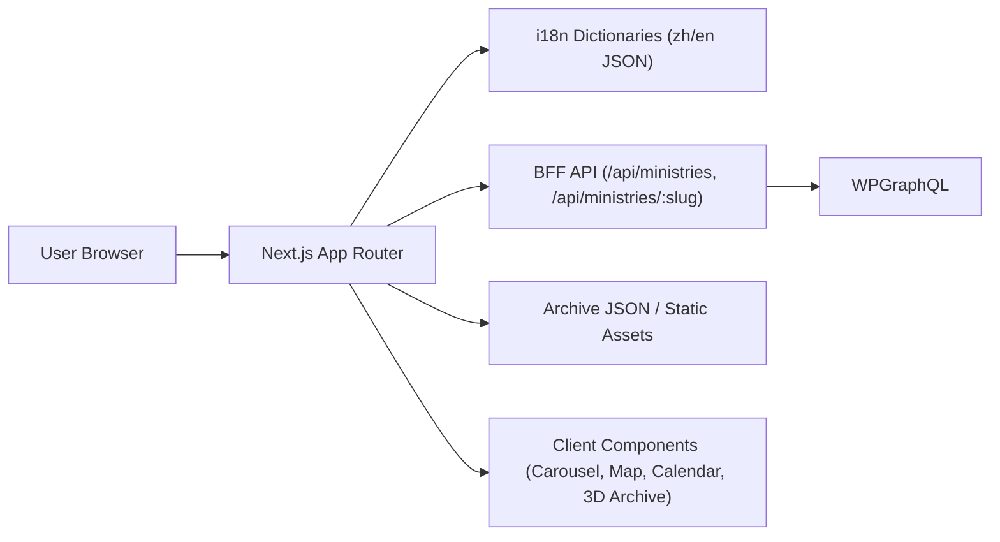
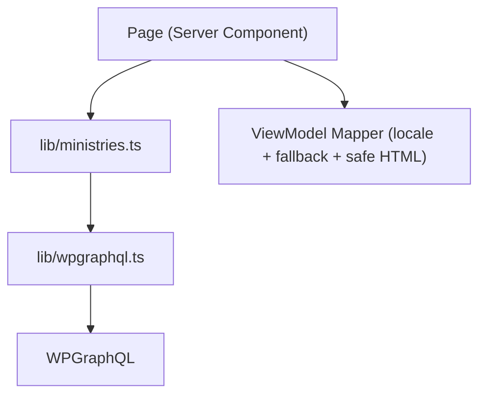

# BRC Web 项目设计文档（Design Doc）

- 版本：v1.0
- 日期：2026-02-08
- 作者：Codex（基于当前仓库代码与构建结果）
- 适用范围：`/Users/dianziji/Documents/Job/BRC/brc-web`

## 1. 背景与目标

本项目是 BRC 官方网站，采用 Next.js App Router + TypeScript + Tailwind，当前核心目标是：

1. 提供中英双语官网体验（`/zh`、`/en`）。
2. 以 WordPress + WPGraphQL 作为事工内容来源。
3. 提供稳定的公开访问与后续扩展能力（归档、训练平台、活动等）。

本设计文档覆盖：

1. 当前项目全面分析（架构、数据流、质量现状）。
2. 可执行的优化建议（按优先级）。
3. 未来功能演进计划（30/60/90 天）。

## 2. 当前系统总览

## 2.1 技术栈

1. 框架：Next.js 16.1.6（App Router）
2. 语言：TypeScript（`strict: true`）
3. UI：React 19 + Tailwind CSS 4
4. 数据源：WordPress（WPGraphQL）
5. 图形：ECharts（世界地图可视化）

## 2.2 代码规模（当前快照）

1. `src` 下 TS/TSX 文件数：32
2. `src` 主要源码总行数（ts/tsx/css/json）：3787
3. i18n 叶子键：`zh=141`、`en=141`，键位一致（无缺失）
4. Archive 静态数据条目：30 条（`src/data/ministryArchive.json`）

## 2.3 高层架构

## 2.4 路由与模块

1. 本地化路由：`src/app/[locale]/(site)/...`
2. API 路由：
   - `src/app/api/ministries/route.ts`
   - `src/app/api/ministries/[slug]/route.ts`
   - `src/app/api/nav/route.ts`（当前占位）
3. 中间件：`src/middleware.ts`（做 locale 重写与 cookie 写入）
4. 数据聚合：
   - `src/lib/wpgraphql.ts`
   - `src/lib/ministries.ts`
   - `src/lib/sections.ts`

## 3. 当前实现评估

## 3.1 优点

1. 双语体系完整：路由、消息字典、语言切换、CMS 字段 fallback 都已实现。
2. 分层意识较清晰：`lib`（数据逻辑）与 `app/api`（BFF）已拆分。
3. 具备基础缓存策略：WP 请求与页面均使用 `revalidate: 60`。
4. 页面骨架完整：首页、事工、关于、祷告、奉献、日历、归档均已可访问。
5. 生产构建可通过：`npm run build` 成功生成全部 27 个静态页面。

## 3.2 主要短板

1. 稳定性短板：存在明确资源缺失与 lint 错误。
2. 数据访问路径有冗余：Server Component 通过 `SITE_URL` 回调自身 API。
3. 安全与内容治理不足：`dangerouslySetInnerHTML` 无显式清洗策略。
4. 工程化能力薄弱：无自动化测试、无监控指标、日志结构化不足。
5. 性能成本偏高：静态媒体体积较大（多张 6MB+ 图片、6MB 视频、1MB 地图）。

## 4. 问题清单（按优先级）

## 4.1 P0（立即处理）

1. 祷告页图片引用缺失，线上会出现 404 图像请求。
   - 证据：`src/app/[locale]/(site)/prayer/page.tsx` 引用了 `/images/AdobeStock_536214384.jpeg`，但 `public/images` 不存在该文件。

## 4.2 P1（本迭代处理）

1. 内部 API 回环依赖 `SITE_URL`，部署与本地环境脆弱。
   - 证据：`src/app/[locale]/(site)/ministries/[top]/page.tsx`、`src/app/[locale]/(site)/ministries/[top]/[slug]/page.tsx`
   - 问题：Server Component 本可直接调 `lib`，当前却走 HTTP 自调用。

2. 详情页按 `slug` 查询但 URL 带 `top`，存在路径语义不一致与潜在重复内容问题。
   - 证据：`src/app/[locale]/(site)/ministries/[top]/[slug]/page.tsx` 未校验 `top` 与真实 `section.top` 一致。

3. API 错误默认返回 200，监控和客户端难以区分失败态。
   - 证据：`src/app/api/ministries/route.ts` catch 分支返回 `NextResponse.json({ items: [], error })` 未带 5xx。

4. 中间件命名已被 Next.js 标记为弃用。
   - 证据：`npm run build` 提示 `middleware` convention deprecated，建议迁移到 `proxy`。

5. XSS 风险面未收敛。
   - 证据：`src/app/[locale]/(site)/ministries/[top]/[slug]/page.tsx` 使用 `dangerouslySetInnerHTML` 渲染 CMS 字段。

## 4.3 P2（近期处理）

1. Lint 当前失败（3 error + 3 warning）。
   - 证据：`npm run lint` 输出 `no-explicit-any`、hooks 依赖告警、unused type。

2. 存在占位链接 `href="#"`，影响可用性与可访问性。
   - 证据：`src/app/[locale]/(site)/prayer/page.tsx`。

3. 内部跳转大量使用 `<a href>`，未统一使用 `next/link`。
   - 影响：丢失部分 SPA 导航与预取收益。

4. 日志使用 `console.log`，缺少统一 trace id 与结构化字段。
   - 证据：`src/lib/wpgraphql.ts`、`src/app/api/ministries/*.ts`

5. 媒体资源偏大。
   - 例：`public/images/jonathan-j-castellon-EzH88o2GxJ4-unsplash.jpg` 9.3MB，`public/videos/hero-test.mp4` 6.0MB。

6. 测试体系缺失。
   - 当前未发现单元、集成、E2E 测试目录与脚本。

## 5. 目标架构与改造设计

## 5.1 设计原则

1. 数据就近访问：Server Component 尽量直接调用 `lib`，避免内部 HTTP hop。
2. 安全默认开启：任何 HTML 渲染必须经过白名单清洗。
3. 可观测优先：错误必须可分级、可追踪、可告警。
4. 内容与产品分治：延续“WP 管内容，新数据库管训练平台状态数据”。

## 5.2 推荐目标数据流

补充说明：

1. 页面直接调 `lib`，仅对外部客户端保留必要 API。
2. 对外 API 层继续存在，但只承担“第三方访问”职责，不再成为页面内部依赖。

## 5.3 关键改造项

1. **移除 `SITE_URL` 内部依赖链**
   - 页面直接调用 `getMinistriesList/getMinistryDetail`。
   - 保留 API 作为外部接口，避免双份业务逻辑。

2. **统一错误语义**
   - API 失败返回明确状态码（400/404/500）。
   - 页面侧区分“无数据”和“请求失败”。

3. **富文本安全治理**
   - 对 CMS HTML 做服务端清洗（白名单标签与属性）。
   - 记录被过滤字段，便于运营排查。

4. **路由一致性**
   - 详情页校验 URL `top` 与实际 `section.top`。
   - 不一致时重定向到 canonical URL。

5. **Next 16 兼容升级**
   - 将 `middleware.ts` 迁移到 `proxy` 约定。

6. **静态资源治理**
   - 建立图片体积预算与自动压缩流程。
   - 关键大图改为响应式尺寸与现代格式（WebP/AVIF）。

7. **工程化补齐**
   - 引入基础测试金字塔：
     - 单元：`lib` 数据映射与 fallback 逻辑
     - 集成：API 路由返回语义
     - E2E：核心路由与双语切换流程

## 6. 优化建议（可直接排期）

## 6.1 短期（1-2 周）

1. 修复 P0 资源缺失问题（祷告页图片）。
2. 消除当前 lint error，保证 CI 可设置为强制门禁。
3. API 错误码改造 + 页面错误展示标准化。
4. 移除 `href="#"` 占位链接或替换为真实目标。
5. 建立最小监控：请求耗时、WP 错误率、5xx 计数。

## 6.2 中期（2-6 周）

1. 改造 ministries 页面数据流，取消内部 API 回环调用。
2. 详情页增加 canonical 校验与重定向。
3. 引入 HTML sanitize 机制。
4. `middleware` 迁移到 `proxy`。
5. 建立首批自动化测试（至少覆盖路由、i18n、ministries API）。

## 6.3 长期（6-12 周）

1. 归档数据从 JSON 迁移到 WP CPT + ACF + WPGraphQL。
2. 训练平台按新数据库方案分层落地（用户、课程、进度、权限）。
3. 建立端到端发布质量门禁（lint + test + build + lighthouse 基线）。

## 7. 未来计划（30/60/90 天）

## 7.1 30 天（稳定性阶段）

目标：把项目从“可运行”提升到“可稳定上线”。

交付物：

1. P0/P1 问题全部关闭。
2. CI 门禁上线：`lint + build + smoke test`。
3. 首版可观测看板（错误率、响应时间、WP 失败统计）。

验收标准：

1. `main` 分支 lint 0 error。
2. 构建告警仅保留可接受项（无弃用阻塞项）。
3. 核心路径（首页、事工列表、详情、语言切换）人工回归通过。

## 7.2 60 天（架构收敛阶段）

目标：消除技术债并收敛数据访问架构。

交付物：

1. ministries 页面直连 `lib`（不再依赖 `SITE_URL` 内部 HTTP）。
2. 详情页 canonical 策略生效。
3. HTML 内容安全策略上线并验证。
4. 媒体资产优化一期完成（大图压缩和尺寸分级）。

验收标准：

1. 首屏关键页面加载耗时下降（相对基线）。
2. API 与页面错误语义一致，日志可追踪。
3. 安全扫描不再标记富文本直出风险。

## 7.3 90 天（能力扩展阶段）

目标：进入可持续迭代状态，为训练平台做准备。

交付物：

1. 归档数据从 JSON 迁移至 WP（完成导入与查询联通）。
2. 训练平台技术选型与 schema 评审完成。
3. 测试体系扩展：关键模块单测 + 基础 E2E 固化。

验收标准：

1. 归档页面数据来源切换后无功能回退。
2. 训练平台 PoC 跑通登录/课程列表/权限控制主链路。
3. 发布流程有清晰回滚方案并演练至少一次。

## 8. 指标与质量门禁

建议纳入持续跟踪的指标：

1. 可用性：5xx 比例、API 失败率、页面崩溃率。
2. 性能：LCP、首页首屏时间、WP 查询平均耗时。
3. 质量：lint 错误数、测试通过率、回归缺陷数。
4. 业务：双语页面访问占比、事工详情点击率、捐赠页面到达率。

## 9. 风险与回滚

1. 风险：WP 数据结构调整导致字段不兼容。
   - 缓解：GraphQL 查询版本化 + fallback 字段策略。
2. 风险：富文本清洗过严影响展示。
   - 缓解：白名单灰度发布 + 运营预览环境。
3. 风险：资源压缩导致视觉质量下降。
   - 缓解：关键素材走人工验收，按页面分级压缩。

回滚策略：

1. 页面改造采用 feature flag。
2. API 改造保留旧响应结构一个发布周期。
3. 归档迁移阶段保留 JSON 兜底开关。

## 10. 立即执行清单（建议从这里开始）

1. 修复 `src/app/[locale]/(site)/prayer/page.tsx` 图片路径错误。
2. 修复 lint 报错并开启 CI fail-fast。
3. ministries 页面去 `SITE_URL` 化改造（直连 `lib`）。
4. API 失败返回规范状态码。
5. 详情页加入 `top` 一致性校验与 canonical 重定向。
6. 引入 HTML sanitize，替换裸 `dangerouslySetInnerHTML`。
7. `middleware` 迁移 `proxy`。

---

## 附录 A：本次分析执行结果摘要

1. `npm run lint`：失败（3 errors, 3 warnings）。
2. `npm run build`：成功（27/27 路由生成），但有 `middleware` 弃用警告。
3. 资源扫描：`/images/AdobeStock_536214384.jpeg` 引用缺失。
4. i18n 键位：中英 141 个叶子键完全一致。
5. 资产体积：存在多张 6MB+ 图片与 6MB 视频，需优化。
