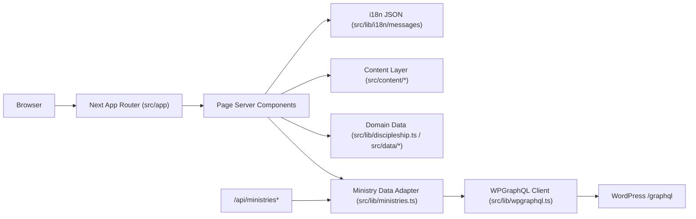

# BRC Web 项目设计文档（新人可读版）

- 文档版本：v2.0
- 更新日期：2026-02-18
- 项目路径：`/Users/dianziji/Documents/Job/BRC/brc-web`
- 目标读者：第一次接触该项目的开发、设计、内容运营、测试同学

---

## 1. 这是什么项目

这是 BRC 官网前端项目，主要职责是：

1. 提供中英文双语官网（`/zh`、`/en`）。
2. 展示多个站点页面（首页、事工、门徒训练、日历、奉献、禱告等）。
3. 从 WordPress（WPGraphQL）读取 ministries 动态内容。
4. 在上游慢/失败时保证页面“可退化可展示”（safe fallback）。

一句话总结：这是一个 **Next.js 16 + App Router** 的双语站点，内容来源是 **本地内容文件 + i18n 字典 + WordPress GraphQL**。

---

## 2. 技术栈与工具（做什么用）

## 2.1 运行时与框架

1. Next.js 16.1.6（App Router）：路由、SSR、构建、缓存。
2. React 19：组件渲染。
3. TypeScript（strict）：类型约束与开发安全。
4. Tailwind CSS v4：样式系统。

## 2.2 数据与安全

1. WPGraphQL：读取 WordPress ministries 内容。
2. `sanitize-html`：清洗 CMS 富文本，降低 XSS 风险。
3. `next/cache` 的 `unstable_cache`：数据层缓存与复用。

## 2.3 可视化与交互

1. ECharts：`ministries` 页面世界地图可视化。
2. 自定义 carousel / 3D archive：前端展示组件。

## 2.4 工程质量

1. ESLint（Next 官方规则集）。
2. Node 内置 test runner（`node --test`）。
3. GitHub Actions CI（`test + lint + build`）。

---

## 3. 整体架构（一图看懂）

说明：

1. 页面渲染主要走 `src/app/[locale]/(site)` 的 Server Components。
2. ministries 动态数据通过 `src/lib/ministries.ts` 统一访问。
3. API 路由作为 BFF 对外接口保留，但页面本身不依赖 API 回环。

---

## 4. 请求生命周期（关键链路）

## 4.1 locale 进入站点

1. `src/proxy.ts` 检查 URL 是否带 locale。
2. 没带 locale 时重定向到默认 `/{defaultLocale}`（当前是 `/zh`）。
3. 同时设置 `NEXT_LOCALE` cookie。
4. `src/app/layout.tsx` 读取 cookie，设置 `<html lang="...">`。

## 4.2 ministries 列表与详情

1. 页面调用 `getMinistriesListSafeResult` / `getMinistryDetailSafeResult`。
2. `src/lib/ministries.ts` 调用 `wpgraphql()` 访问 WP。
3. `src/lib/wpgraphql.ts` 处理 timeout、retry、错误分类。
4. 上游失败时返回 `degraded=true`，页面展示“暂时不可用 + 重试提示”。
5. 详情页会检查 URL 的 `top` 与真实分类是否一致，不一致执行 canonical redirect。

## 4.3 富文本安全

1. ministries 详情页 summary 使用 `sanitizeRichHtml()`。
2. 外部链接统一使用 `target="_blank" + rel="noopener noreferrer"`。
3. `sanitize-html` 白名单限制可渲染标签和协议。

---

## 5. 目录地图（东西都在哪里）

| 路径 | 职责 |
|---|---|
| `src/app` | 路由入口与页面（App Router） |
| `src/app/[locale]/(site)` | 主站页面路由（双语） |
| `src/app/api` | BFF API 路由 |
| `src/lib` | 数据访问、i18n、安全、业务工具函数 |
| `src/content` | 页面内容层（可维护的结构化内容） |
| `src/data` | 原始静态数据（archive、地图区域等） |
| `src/components` | 可复用 UI 组件 |
| `public` | 图片、视频、地图 json 等静态资源 |
| `tests` | 单元与架构护栏测试 |
| `.github/workflows` | CI 配置 |
| `docs` | 架构与重构文档 |

---

## 6. 路由清单（前端 + API）

## 6.1 页面路由（`src/app/[locale]/(site)`）

1. `/{locale}`：首页。
2. `/{locale}/about`。
3. `/{locale}/calendar`。
4. `/{locale}/prayer`。
5. `/{locale}/ministries`。
6. `/{locale}/ministries/[top]`。
7. `/{locale}/ministries/[top]/[slug]`。
8. `/{locale}/ministries/archive`。
9. `/{locale}/ministries/archive/3d`。
10. `/{locale}/discipleship`。
11. `/{locale}/discipleship/[course]`。
12. `/{locale}/trainings`（alias，重定向到 `/{locale}/discipleship`）。
13. `/{locale}/audio`、`/{locale}/contact`、`/{locale}/donation`。

## 6.2 API 路由（`src/app/api`）

1. `/api/ministries`：返回 ministries 列表，支持 `?top=...`。
2. `/api/ministries/[slug]`：返回单个 ministry 详情。
3. `/api/nav`：当前是占位接口（返回空数组）。

---

## 7. 数据来源与“改哪里”

## 7.1 i18n 文案字典

1. `src/lib/i18n/messages/zh.json`
2. `src/lib/i18n/messages/en.json`

适合改：导航文案、静态页面文案、按钮文本、通用提示。

## 7.2 内容层（`src/content`）

1. `src/content/calendar/events.ts`：日历事件。
2. `src/content/discipleship/overview.ts`：门训结构、学习路径、优化项。
3. `src/content/discipleship/copy.ts`：门训页面/详情页固定双语文案。
4. `src/content/ministries/top-sections.ts`：ministries 顶层入口卡片。
5. `src/content/ministries/archive.ts`：archive 类型与排序逻辑。

适合改：页面内业务数组、可配置展示信息、双语 copy。

## 7.3 静态业务数据层

1. `src/lib/discipleship.ts`：门训课程主数据与详情块（仍是重要数据源）。
2. `src/data/ministryArchive.json`：archive 原始列表数据。
3. `src/data/ministryRegions.ts`：地图高亮国家列表。

## 7.4 动态 CMS 数据（WordPress）

1. `src/lib/ministries.ts`：WP ministries 列表/详情适配层。
2. `src/lib/wpgraphql.ts`：GraphQL 请求、超时、重试、错误分类。
3. `src/lib/sections.ts`：section leaf/top 归一化规则。
4. `src/lib/donation/index.ts`：Donation provider 入口（WP/Supabase 解耦适配）。

---

## 8. 核心模块说明（按职责）

## 8.1 i18n 系统

关键文件：`src/lib/i18n/index.ts`

提供能力：

1. `normalizeLocale()`：标准化 locale。
2. `withLocale()` / `stripLocale()`：路由拼装与剥离。
3. `pickLocalized()`：优先用当前语言字段，自动 fallback。
4. `Localized<T>` + `pickLocalizedValue()`：统一双语值模型。

## 8.2 locale 代理

关键文件：`src/proxy.ts`

行为：

1. 缺少 locale 自动重定向到 `/zh`。
2. 设置 `NEXT_LOCALE` cookie。
3. 跳过 `/api`、`/_next`、静态文件等路径。

## 8.3 ministries 领域层

关键文件：`src/lib/ministries.ts`

行为：

1. 提供 list/detail 查询。
2. 使用 `unstable_cache` 做数据缓存（revalidate=60）。
3. 自动探测 external URL 字段（可配置主字段，失败 fallback）。
4. 提供 safe result（`degraded`）供页面降级 UI 使用。

## 8.4 WP 请求层

关键文件：`src/lib/wpgraphql.ts`

行为：

1. `AbortController` 超时控制（`WP_GRAPHQL_TIMEOUT_MS`）。
2. timeout/network 限次重试（`WP_GRAPHQL_RETRY_COUNT`、`WP_GRAPHQL_RETRY_BACKOFF_MS`）。
3. 错误分类：`config`、`timeout`、`http`、`graphql`、`invalid_response`、`network`。

## 8.5 安全层

关键文件：`src/lib/sanitize-html.ts`

行为：

1. 白名单过滤富文本标签与属性。
2. 限制链接协议。
3. 外部链接注入 `noopener noreferrer`。

---

## 9. 环境变量与配置

本地需要 `.env.local`，当前使用到的 key：

1. `WP_GRAPHQL_URL`：WordPress GraphQL 端点。
2. `WP_GRAPHQL_TIMEOUT_MS`：单次请求超时。
3. `WP_GRAPHQL_RETRY_COUNT`：超时/网络错误重试次数。
4. `WP_GRAPHQL_RETRY_BACKOFF_MS`：重试退避基线毫秒。
5. `SITE_URL`：保留变量（当前页面主链路已不依赖内部回环）。

相关配置文件：

1. `next.config.ts`：远程图片白名单域名。
2. `tsconfig.json`：TypeScript strict + 路径别名 `@/*`。
3. `eslint.config.mjs`：Next 官方 lint 规则。
4. `postcss.config.mjs`：Tailwind PostCSS 插件。

---

## 10. 本地开发与运行

## 10.1 命令

1. `npm install`
2. `npm run dev`
3. `npm run test`
4. `npm run lint`
5. `npm run build`

## 10.2 访问

1. 打开 `http://localhost:3000`。
2. 会由 proxy 自动跳转到 `/zh`。

---

## 11. 测试与质量保障

## 11.1 测试结构

1. `tests/wpgraphql.test.ts`：WP 请求层错误分类/重试逻辑。
2. `tests/sanitize-html.test.ts`：HTML 清洗安全规则。
3. `tests/refactor-guardrails.test.ts`：架构护栏（proxy、loading、safe fallback、content 归档等）。
4. `tests/test-loader.mjs` + `tests/stubs/server-only.mjs`：Node 测试兼容层。

## 11.2 CI

文件：`.github/workflows/quality.yml`

触发：

1. push `main`
2. pull request

流程：

1. `npm ci`
2. `npm test`
3. `npm run lint`
4. `npm run build`

---

## 12. 新人上手：常见需求改哪里

## 12.1 改导航文案

1. `src/lib/i18n/messages/zh.json`
2. `src/lib/i18n/messages/en.json`

## 12.2 新增一个 calendar 活动

1. 优先在 WordPress 新增/发布 `Event` 内容（`events` + `eventFields`）。
2. 仅在 WP 临时不可用时，才改 `src/content/calendar/events.ts` 作为 fallback。

## 12.3 修改 ministries 顶部三大分类（Mission/Youth/Family）

1. `src/content/ministries/top-sections.ts`。

## 12.4 修改门训页面静态文案

1. `src/content/discipleship/copy.ts`
2. `src/content/discipleship/overview.ts`
3. 如需改课程核心数据，再改 `src/lib/discipleship.ts`

## 12.5 修改 archive 页面数据

1. 原始数据：`src/data/ministryArchive.json`
2. 排序与类型：`src/content/ministries/archive.ts`

## 12.6 修改 WP ministries 查询策略

1. 查询与 fallback：`src/lib/ministries.ts`
2. timeout/retry：`src/lib/wpgraphql.ts`
3. 页面降级 UI：`src/app/[locale]/(site)/ministries/**`

---

## 13. 静态资源与前端资产

主要位置：

1. 图片：`public/images`
2. 视频：`public/videos/hero-test.mp4`
3. 地图数据：`public/maps/world.json`

说明：

1. 组件中大量使用 `next/image`，但也有部分 ``（主要在 CMS/动态图场景）。
2. `next.config.ts` 已配置 `newbethelrc.org`、`*.wp.com` 远程图白名单。

---

## 14. 当前状态评估（2026-02-18 快照）

## 14.1 已达到

1. ministries 核心链路具备 timeout + retry + safe fallback。
2. `proxy.ts` 已替代旧 middleware 约定。
3. ministries 详情页有 canonical redirect 与 HTML sanitize。
4. 已有基础自动化测试与 CI 质量门禁。
5. 内容层已建立（`src/content`），并持续迁移页面常量。
6. Donation 已完成 provider 适配层预埋，后续可平滑切换到 Supabase 入口。
7. `src/lib/auth` 与 `src/lib/rbac` 已建立扩展骨架，便于后续接 RBAC。

## 14.2 仍需继续优化

1. 双语模型尚未完全统一，`src/lib/discipleship.ts` 仍大量 `xxZh/xxEn` 结构。
2. 部分页面仍有占位链接（例如 `/prayer` 的 `href="#"`）。
3. `/api/nav` 仍是空实现。
4. 静态资源体积仍有优化空间（大图与首页视频）。
5. Supabase Auth/RLS 仍未接入，仅完成架构骨架与接口预留。

---

## 15. 与重构计划的关系

本项目正在按 `docs/website-architecture-content-i18n-refactor-plan-2026-02-10.md` 分阶段推进。

建议阅读顺序：

1. 先读本文档（了解当前结构与文件定位）。
2. 再读 refactor plan（了解阶段目标、验收标准与后续路线）。
3. 若做权限与业务入口扩展，再读 `docs/supabase-rbac-foundation-2026-02-19.md`。
4. 若做 Donation 全流程迁移，再读 `docs/donation-implementation-playbook-2026-02-19.md`。

---

## 16. 术语表（给非开发同学）

1. App Router：Next.js 的文件路由系统。
2. Server Component：在服务端执行的数据与渲染组件。
3. BFF：给前端服务的 API 层（本项目是 `/api/*`）。
4. ISR / revalidate：页面或数据按时间间隔重新生成缓存。
5. Degraded：上游失败时，页面使用降级内容继续可访问。
6. Canonical Redirect：把非标准 URL 重定向到标准 URL，避免重复内容。

---

## 附录 A：关键文件速查

1. 站点根布局：`src/app/layout.tsx`
2. locale 代理：`src/proxy.ts`
3. site layout：`src/app/[locale]/(site)/layout.tsx`
4. ministries 领域层：`src/lib/ministries.ts`
5. WP GraphQL 客户端：`src/lib/wpgraphql.ts`
6. HTML 清洗：`src/lib/sanitize-html.ts`
7. i18n 工具：`src/lib/i18n/index.ts`
8. i18n 字典：`src/lib/i18n/messages/*.json`
9. 内容层入口：`src/content/**`
10. API 路由：`src/app/api/**`
11. 测试：`tests/**`
12. CI：`.github/workflows/quality.yml`

---

## 17. 按角色阅读路径（新人导航）

## 17.1 前端开发

建议顺序：

1. 第 3 节（整体架构）。
2. 第 5 节（目录地图）。
3. 第 6 节（路由清单）。
4. 第 7 节（数据来源与改哪里）。
5. 第 8 节（核心模块说明）。
6. 第 12 节（常见需求改哪里）。

你最常改的文件：

1. `src/app/[locale]/(site)/**`
2. `src/components/**`
3. `src/content/**`
4. `src/lib/i18n/messages/*.json`

## 17.2 内容运营 / 文案同学

建议顺序：

1. 第 1 节（项目是什么）。
2. 第 7 节（数据来源与改哪里）。
3. 第 12 节（常见需求改哪里）。

你最常改的文件：

1. `src/lib/i18n/messages/zh.json`
2. `src/lib/i18n/messages/en.json`
3. `src/content/calendar/events.ts`
4. `src/content/discipleship/copy.ts`
5. `src/content/discipleship/overview.ts`
6. `src/data/ministryArchive.json`

## 17.3 后端 / 集成开发（WP 对接）

建议顺序：

1. 第 4 节（请求生命周期）。
2. 第 8 节（ministries、wpgraphql、安全层）。
3. 第 9 节（环境变量）。
4. 第 6.2 节（API 路由）。

你最常改的文件：

1. `src/lib/wpgraphql.ts`
2. `src/lib/ministries.ts`
3. `src/lib/sections.ts`
4. `src/app/api/ministries/route.ts`
5. `src/app/api/ministries/[slug]/route.ts`

## 17.4 QA / 测试同学

建议顺序：

1. 第 6 节（路由清单）。
2. 第 11 节（测试与质量保障）。
3. 第 14 节（当前状态评估）。

你最常用的文件与命令：

1. `tests/refactor-guardrails.test.ts`
2. `tests/wpgraphql.test.ts`
3. `tests/sanitize-html.test.ts`
4. `npm test`
5. `npm run lint`
6. `npm run build`

## 17.5 新成员第一天建议

1. 拉代码并配置 `.env.local`（见第 9 节）。
2. 跑 `npm install`、`npm run dev`，确认站点可打开。
3. 跑 `npm test` 与 `npm run lint`，确认本地环境一致。
4. 读第 12 节，先做一个“低风险改动”熟悉流程（例如加一个 calendar 事件）。

---

## 18. 发布前检查清单（Release Checklist）

## 18.1 必做检查（阻塞项）

1. 环境变量齐全且正确（至少 `WP_GRAPHQL_URL`、超时重试参数）。
2. `npm test` 全通过。
3. `npm run lint` 无 error。
4. `npm run build` 成功。
5. 核心页面可访问：`/zh`。
6. 核心页面可访问：`/en`。
7. 核心页面可访问：`/zh/ministries`。
8. 核心页面可访问：`/zh/ministries/[top]`（至少一个实际分类）。
9. 核心页面可访问：`/zh/ministries/[top]/[slug]`（至少一个实际详情）。
10. 核心页面可访问：`/zh/discipleship`。
11. 核心链路验证：ministries 上游失败时可看到降级提示（不是白屏/500）。
12. 核心链路验证：ministries 详情页外链带 `noopener noreferrer`。
13. 核心链路验证：ministries 详情页 top 不一致会 canonical 重定向。

## 18.2 建议检查（非阻塞但强烈推荐）

1. 抽查中英切换是否保持当前路径语义。
2. 抽查主要图片是否加载正常（特别是首页、about、ministries）。
3. 抽查 `public/videos/hero-test.mp4` 在移动端体验是否可接受。
4. 抽查 `/api/ministries` 与 `/api/ministries/[slug]` 返回状态码语义。

## 18.3 发布执行步骤

1. 合并前在 PR 里附上本地验证结果：`npm test`。
2. 合并前在 PR 里附上本地验证结果：`npm run lint`。
3. 合并前在 PR 里附上本地验证结果：`npm run build`。
4. 确认 CI `Quality` 工作流通过。
5. 上线后做 smoke：访问 `/zh`、`/en`。
6. 上线后做 smoke：打开 ministries 列表和任一详情。
7. 上线后做 smoke：打开 discipleship 页面。
8. 观察日志中 WP timeout/retry 频率，确认未出现异常暴涨。

## 18.4 故障快速回滚建议

1. 若是文案/内容问题：优先回滚对应 `src/content/**` 或 `messages/*.json` 变更。
2. 若是 ministries 数据链路问题：优先回滚 `src/lib/ministries.ts` 与 `src/lib/wpgraphql.ts` 相关提交。
3. 若是路由行为问题：优先检查并回滚 `src/proxy.ts` 或路由页面提交。
