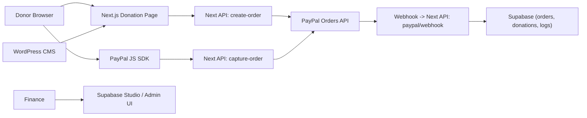

# BRC Donation 实施手册（Next.js + PayPal + Supabase）

- 版本：v1.1（2026-02-26 修订）
- 初版日期：2026-02-19
- 适用仓库：`/Users/dianziji/Documents/Job/BRC/brc-web`
- 目标：在保留现有 CMS 链路（WordPress + WPGraphQL）的前提下，把 Donation 全流程独立到 `Next.js + PayPal API + Supabase`

> **v1.1 修订摘要**：补充 `NEXT_PUBLIC_PAYPAL_CLIENT_ID` 环境变量；明确 Webhook 验签必须使用原始 body；补充幂等索引 SQL；新增 PayPal Idempotency Key 说明；新增 Access Token 缓存说明；明确 Capture/Webhook 竞争条件处理；补充视图访问权限；新增支付失败前端处理；补充 `order_id` 索引；修正 `locale` 默认值。

---

## 1. 范围与边界

本手册覆盖：

1. Supabase 项目与表结构设计
2. Donation 表单字段设计
3. PayPal 下单/扣款/Webhook 流程
4. 财务查询后台（先用 Supabase Studio，后续可做自建后台）
5. 安全基线（密钥、RBAC、RLS、幂等、防篡改）

本手册暂不覆盖：

1. Zelle 流程（你已明确先不纳入）
2. PayPal 逐笔自动转银行（先不做）
3. 完整活动报名系统（只预留"费用类型/用途"扩展）

---

## 2. 当前项目现状（与你仓库一致）

当前仓库已经是：

1. Next.js App Router 前端站点（双语路由）
2. WordPress 仅作为内容源，通过 `WPGraphQL` 拉取内容
3. Donation 页面目前是外链跳转到 WordPress 表单
   文件：`/Users/dianziji/Documents/Job/BRC/brc-web/src/app/[locale]/(site)/donation/page.tsx`

目标改造后：

1. WordPress 继续负责 CMS
2. Donation 不再依赖 GiveWP
3. Donation 数据进入 Supabase，PayPal 只做支付通道

---

## 3. 目标架构



---

## 4. 分阶段实施计划

## Phase 1（MVP，上线可用）

1. 建 Supabase 项目和基础表
2. 接 PayPal 下单 + capture
3. 交易写入 Supabase
4. 发送基础 receipt 邮件（可选先关）
5. 财务先用 Supabase Studio 看明细和导出

## Phase 2（生产增强）

1. 完整 webhook 验签与幂等重试
2. 自建 `/admin/donations` 查询页（角色分级）
3. 对账导出模板与月结流程
4. 失败补偿脚本（按 order id 重拉）

---

## 5. Supabase 配置

## 5.1 创建项目

1. 在 Supabase 创建新项目（建议独立项目，不和实验项目混用）
2. 记录：
   - `Project URL`
   - `anon key`
   - `service_role key`（仅服务端）
3. 在 Authentication 开启邮箱登录（给财务后台使用）
4. 开启 MFA（至少给 admin/finance 用户）

## 5.2 环境变量（Next.js）

在本地 `.env.local` 与部署平台都配置：

```bash
# Existing
WP_GRAPHQL_URL=
WP_GRAPHQL_TIMEOUT_MS=
WP_GRAPHQL_RETRY_COUNT=
WP_GRAPHQL_RETRY_BACKOFF_MS=
SITE_URL=

# Supabase
NEXT_PUBLIC_SUPABASE_URL=
NEXT_PUBLIC_SUPABASE_ANON_KEY=
SUPABASE_SERVICE_ROLE_KEY=

# PayPal
PAYPAL_ENV=sandbox
NEXT_PUBLIC_PAYPAL_CLIENT_ID=   # ⚠️ 浏览器端 PayPal JS SDK 使用，必须暴露
PAYPAL_CLIENT_ID=                # 服务端（获取 Access Token）
PAYPAL_CLIENT_SECRET=            # 服务端，绝不暴露到前端
PAYPAL_WEBHOOK_ID=

# Optional: receipt mail
RECEIPT_EMAIL_FROM=
RECEIPT_EMAIL_PROVIDER_API_KEY=
```

规则：

1. `SUPABASE_SERVICE_ROLE_KEY`、`PAYPAL_CLIENT_SECRET` 只能在服务端使用
2. 任何 `NEXT_PUBLIC_*` 都会暴露到浏览器
3. `NEXT_PUBLIC_PAYPAL_CLIENT_ID` 与 `PAYPAL_CLIENT_ID` 值相同，分开声明是为了职责清晰——前者供 SDK 使用，后者供服务端 OAuth2 获取 Access Token

---

## 6. 数据库设计（可直接执行 SQL）

在 Supabase SQL Editor 执行：

```sql
-- 1) Enums
create type payment_provider as enum ('paypal');
create type donation_status as enum ('created', 'approved', 'captured', 'failed', 'refunded');
create type fund_type as enum ('general', 'mission', 'building', 'youth', 'registration');

-- 2) Orders: 记录每次创建订单
create table if not exists donation_orders (
  id uuid primary key default gen_random_uuid(),
  provider payment_provider not null default 'paypal',
  provider_order_id text not null unique,
  status donation_status not null default 'created',
  amount numeric(12,2) not null check (amount > 0),
  currency text not null default 'USD',
  donor_name text not null,
  donor_email text not null,
  memo text,
  fund fund_type not null default 'general',
  purpose_code text not null default 'donation', -- donation | registration_xxx
  locale text not null default 'en',             -- ⚠️ 默认改为 'en'，双语站更安全
  created_at timestamptz not null default now(),
  updated_at timestamptz not null default now()
);

-- 3) Transactions: capture 成功后的真实入账记录
create table if not exists donation_transactions (
  id uuid primary key default gen_random_uuid(),
  order_id uuid not null references donation_orders(id) on delete cascade,
  provider_capture_id text not null unique,
  provider_payment_id text,
  gross_amount numeric(12,2) not null check (gross_amount > 0),
  fee_amount numeric(12,2),
  net_amount numeric(12,2),
  currency text not null default 'USD',
  captured_at timestamptz not null,
  payer_name text,
  payer_email text,
  raw_payload jsonb not null default '{}'::jsonb,
  created_at timestamptz not null default now()
);

-- ⚠️ 补充：order_id 索引（加速 JOIN 和外键查询）
create index if not exists idx_transactions_order_id
  on donation_transactions(order_id);

-- 4) Receipts: 回执发送记录
create table if not exists donation_receipts (
  id uuid primary key default gen_random_uuid(),
  transaction_id uuid not null references donation_transactions(id) on delete cascade,
  recipient_email text not null,
  sent_at timestamptz,
  provider_message_id text,
  status text not null default 'pending', -- pending | sent | failed
  error_message text
);

-- 5) Audit logs: 审计日志
create table if not exists donation_audit_logs (
  id bigserial primary key,
  event_type text not null, -- create_order | capture | webhook | manual_fix
  provider_event_id text,
  order_id uuid references donation_orders(id) on delete set null,
  metadata jsonb not null default '{}'::jsonb,
  created_at timestamptz not null default now()
);

-- ⚠️ 补充：provider_event_id 唯一索引（Webhook 幂等去重的数据库保障）
create unique index if not exists uidx_audit_logs_event_id
  on donation_audit_logs(provider_event_id)
  where provider_event_id is not null;

-- 6) updated_at trigger
create or replace function set_updated_at()
returns trigger as $$
begin
  new.updated_at = now();
  return new;
end;
$$ language plpgsql;

drop trigger if exists trg_donation_orders_updated_at on donation_orders;
create trigger trg_donation_orders_updated_at
before update on donation_orders
for each row execute function set_updated_at();
```

说明：

1. `donation_orders` 存你表单业务字段（memo/fund/purpose）
2. `donation_transactions` 存真实扣款结果
3. `raw_payload` 保留原始回调，方便财务追溯
4. `idx_transactions_order_id` 加速月度报表 JOIN
5. `uidx_audit_logs_event_id` 是 Webhook 幂等的数据库最后防线

---

## 7. 权限模型（RLS + RBAC）

推荐角色：

1. `donation_admin`：全权限（配置、修复、导出）
2. `donation_finance`：查询、导出、发送回执
3. `viewer`：只读汇总（可选）

实现方式（建议）：

1. 前台捐赠流程全部走 Next.js 服务端 Route Handler（使用 `service_role`，绕过 RLS）
2. 普通用户不直接访问交易表
3. 财务后台使用 Supabase Auth 登录 + RLS 控制

示例策略（先最小可用）：

```sql
alter table donation_orders enable row level security;
alter table donation_transactions enable row level security;
alter table donation_receipts enable row level security;
alter table donation_audit_logs enable row level security;

-- 默认不允许 anon 访问
revoke all on donation_orders from anon, authenticated;
revoke all on donation_transactions from anon, authenticated;
revoke all on donation_receipts from anon, authenticated;
revoke all on donation_audit_logs from anon, authenticated;
```

然后在自建后台阶段再加"按 custom claim 判定角色"的 select policy。

> **注意**：服务端 Route Handler 使用 `service_role` key 初始化 Supabase client，`service_role` 会自动绕过所有 RLS，上述 revoke 不影响服务端写入。

---

## 8. 表单设计（Donation + 可扩展到 Registration）

建议字段：

1. `amount`（必填）
   - 预设按钮：`50/100/200/500`
   - 自定义金额输入
2. `donorName`（必填）
3. `donorEmail`（必填，邮箱格式）
4. `memo`（可选，建议限制 280 字符）
5. `fund`（必填，下拉）
   - `general / mission / building / youth / registration`
6. `purposeCode`（必填，隐藏字段或按钮绑定）
   - 例：`donation_general`、`registration_retreat_2026`
7. `locale`（自动带上，从路由参数获取）

校验规则：

1. amount > 0，最多两位小数
2. donorName 去首尾空格，长度 1-80
3. donorEmail RFC 基础校验
4. memo 过滤 HTML / script（建议使用 `sanitize-html` 或 `DOMPurify` 库，而非手写正则）
5. fund 必须在白名单中

---

## 9. PayPal 配置与流程

## 9.1 PayPal 后台设置

1. 在 PayPal Developer 创建 REST App（Sandbox + Live）
2. 获取 `Client ID` 与 `Client Secret`
3. 配置 Webhook URL：
   - `https://<your-domain>/api/paypal/webhook`
4. 订阅事件（最小集合）：
   - `CHECKOUT.ORDER.APPROVED`
   - `PAYMENT.CAPTURE.COMPLETED`
   - `PAYMENT.CAPTURE.DENIED`
   - `PAYMENT.CAPTURE.REFUNDED`
   - `PAYMENT.CAPTURE.PENDING`（可选，支持 ACH 等延迟确认方式）

## 9.2 服务端 API 设计（Next Route Handlers）

新增文件建议：

1. `/Users/dianziji/Documents/Job/BRC/brc-web/src/app/api/paypal/create-order/route.ts`
2. `/Users/dianziji/Documents/Job/BRC/brc-web/src/app/api/paypal/capture-order/route.ts`
3. `/Users/dianziji/Documents/Job/BRC/brc-web/src/app/api/paypal/webhook/route.ts`
4. `/Users/dianziji/Documents/Job/BRC/brc-web/src/lib/paypal.ts`
5. `/Users/dianziji/Documents/Job/BRC/brc-web/src/lib/supabase/admin.ts`

`create-order` 输入：

```json
{
  "amount": 100,
  "currency": "USD",
  "donorName": "Jane Doe",
  "donorEmail": "jane@example.org",
  "memo": "For mission trip",
  "fund": "mission",
  "purposeCode": "donation_mission",
  "locale": "en"
}
```

`create-order` 服务端逻辑：

1. 校验参数（不信任前端）
2. 写入 `donation_orders(status=created)`，拿到本地 `order_id`
3. 调 PayPal Orders API 创建订单，**请求头必须加 `PayPal-Request-Id: <order_id>`**（⚠️ 防止网络重试重复创建订单）
4. 把本地 `order_id` 放入 PayPal 订单的 `custom_id` 字段（Webhook 回调靠此找回本地记录）
5. 返回 `paypalOrderId` 给前端

`capture-order` 服务端逻辑：

1. 接收 `paypalOrderId`
2. 调 PayPal capture
3. 从返回中提取 capture id / payer / amount
4. 更新 `donation_orders(status=captured)`
5. 写入 `donation_transactions`，使用 **`INSERT ... ON CONFLICT (provider_capture_id) DO NOTHING`**（⚠️ 防止与 Webhook 并发写入报错）
6. 触发 receipt（异步）

Webhook 逻辑（必须有）：

1. **⚠️ 验签前必须读取原始 body**，在 Next.js App Router 中：
   ```ts
   const rawBody = await req.text(); // 读原始字符串，不能用 req.json()
   const body = JSON.parse(rawBody); // 手动解析
   // 把 rawBody 和请求头一起传给 PayPal 验签
   ```
2. 验签（PayPal headers + webhook id + rawBody）
3. 幂等：按 `provider_event_id` 去重（先查 `donation_audit_logs`，已存在则直接返回 200）
4. 回写状态（尤其是退款/拒付）；写 `donation_transactions` 同样用 `ON CONFLICT DO NOTHING`
5. 写入 `donation_audit_logs`

## 9.3 PayPal Access Token 缓存

`paypal.ts` 必须实现 Token 缓存，避免每次调用都重新走 OAuth2（每次约增加 200-500ms，且有速率限制）：

```ts
// src/lib/paypal.ts 参考实现
let cachedToken: { value: string; expiresAt: number } | null = null;

export async function getPayPalAccessToken(): Promise<string> {
  if (cachedToken && Date.now() < cachedToken.expiresAt - 60_000) {
    return cachedToken.value;
  }
  const res = await fetch(`${PAYPAL_BASE_URL}/v1/oauth2/token`, {
    method: 'POST',
    headers: {
      'Content-Type': 'application/x-www-form-urlencoded',
      Authorization: `Basic ${Buffer.from(
        `${process.env.PAYPAL_CLIENT_ID}:${process.env.PAYPAL_CLIENT_SECRET}`
      ).toString('base64')}`,
    },
    body: 'grant_type=client_credentials',
  });
  const data = await res.json();
  cachedToken = {
    value: data.access_token,
    expiresAt: Date.now() + data.expires_in * 1000,
  };
  return cachedToken.value;
}
```

> 注意：Next.js 服务端模块在 serverless 环境下每次冷启动缓存会失效，这是正常的，但热实例复用时可节省大量时间。

---

## 10. 前端页面改造（基于现有 donation page）

当前文件：`/Users/dianziji/Documents/Job/BRC/brc-web/src/app/[locale]/(site)/donation/page.tsx`

改造建议：

1. 保留现有视觉布局
2. 将"外链按钮"改成本地 donation form + PayPal button
3. 增加用途按钮组（Donation / Registration）
4. 成功页显示：
   - donation number（本地 order id）
   - amount/date/email
   - "receipt 已发送/待发送"
5. **⚠️ 新增失败/取消处理页面**：
   - 用户主动取消：显示"您已取消本次捐款，感谢您的关注"，提供重试按钮
   - 支付被拒绝：显示具体原因提示（如"卡片余额不足"），引导联系支持或重试
   - 网络超时：提示用户检查邮件确认是否成功，避免重复操作

按钮分流示例：

1. 奉献按钮：`purposeCode=donation_general`
2. 活动报名按钮：`purposeCode=registration_retreat_2026`

这样财务后台可以按 `purposeCode` 直接筛选。

---

## 11. Receipt 设计

原则：

1. 不只依赖 PayPal 默认通知
2. 你自己发"机构版回执"（含 memo/fund/purpose）

邮件内容建议字段：

1. donorName
2. donorEmail
3. amount / currency
4. donatedAt（绝对时间）
5. fund / purposeCode
6. memo
7. organization legal text（税务声明）
8. transaction reference（capture id + internal id）

---

## 12. 财务后台（先快后稳）

## 12.1 先快速可用

1. 财务先用 Supabase Studio 查看 `donation_orders` + `donation_transactions`
2. 通过 SQL 视图生成月度报表

建议视图：

```sql
create or replace view v_donation_ledger as
select
  o.id as order_id,
  o.created_at as order_created_at,
  o.donor_name,
  o.donor_email,
  o.fund,
  o.purpose_code,
  o.memo,
  t.provider_capture_id,
  t.gross_amount,
  t.fee_amount,
  t.net_amount,
  t.currency,
  t.captured_at
from donation_orders o
left join donation_transactions t on t.order_id = o.id;

-- ⚠️ 授权 finance 角色可查询此视图
-- （MVP 阶段财务通过 Supabase Studio 访问，service_role 已有权限；
--   自建后台阶段需按实际角色配置）
-- grant select on v_donation_ledger to donation_finance;
```

> **说明**：MVP 阶段财务使用 Supabase Studio（用 service_role 或 admin 账号登录），视图无需额外授权。自建后台时再按需开放 RLS policy。

## 12.2 再做自建后台

自建 `/admin/donations` 的功能优先级：

1. 按日期、fund、purposeCode、email 筛选
2. 导出 CSV
3. 查看单笔原始 payload
4. 标记"已对账"

---

## 13. 幂等与异常恢复

必须做的幂等键：

1. `donation_orders.provider_order_id` 唯一（已在 DDL 中定义）
2. `donation_transactions.provider_capture_id` 唯一（已在 DDL 中定义）
3. `donation_audit_logs.provider_event_id` 唯一索引（已在 DDL 中补充）

**Capture 与 Webhook 竞争条件处理**：

`capture-order` API 和 Webhook 都可能写入 `donation_transactions`，需要在两处都使用：

```sql
INSERT INTO donation_transactions (...) VALUES (...)
ON CONFLICT (provider_capture_id) DO NOTHING;
```

若 `DO NOTHING` 返回 0 rows affected，说明对方已写入，不报错，继续后续流程即可。

恢复手段：

1. 后台手动输入 `provider_order_id` 触发重查
2. 对 `created` 超时未完成订单做清理任务（例如 24 小时）

---

## 14. 安全清单（上线前逐条打勾）

1. `PAYPAL_CLIENT_SECRET`、`SUPABASE_SERVICE_ROLE_KEY` 未出现在前端 bundle
2. `NEXT_PUBLIC_PAYPAL_CLIENT_ID` 只是 Client ID（无 Secret），暴露到前端是预期行为
3. Webhook 验签通过才入库（且必须使用原始 body，见 Section 9.2）
4. 所有金额以服务端计算/校验为准
5. `create-order` 使用 `PayPal-Request-Id` 防止重复创建订单
6. API 有速率限制（最少对 create-order）
7. 后台账号强制 MFA
8. 操作日志可追溯（谁在什么时候导出或修改）
9. 定期轮换密钥（至少半年一次）
10. memo 等用户输入使用 `sanitize-html` / `DOMPurify` 净化，不使用手写正则

---

## 15. 测试清单

## 15.1 Sandbox 测试用例

1. 成功支付（PayPal 账户）
2. 成功支付（Card）
3. 用户取消支付 → 前端显示取消提示，不写入 captured 状态
4. 重复点击回调（幂等）→ 数据库不重复写入，返回 200
5. Webhook 延迟到达（最终一致）→ 状态最终正确
6. 退款事件回写 → `donation_orders.status` 更新为 `refunded`
7. **⚠️ 新增**：Capture 与 Webhook 同时到达 → 两者均正常完成，无数据库报错
8. **⚠️ 新增**：`create-order` 网络超时重试 → PayPal-Request-Id 保证不重复创建订单

## 15.2 回归点

1. `/zh/donation` 与 `/en/donation` 都能正常流程
2. 现有 CMS 页面不受影响
3. 财务能按月导出明细

---

## 16. 建议的代码目录（目标结构）

```text
src/
  app/
    [locale]/(site)/donation/page.tsx
    api/
      paypal/
        create-order/route.ts
        capture-order/route.ts
        webhook/route.ts
      donations/
        report/route.ts
  lib/
    paypal.ts          # 含 Access Token 缓存
    donation/
      schema.ts
      service.ts
      receipt.ts
    supabase/
      admin.ts
      client.ts
```

---

## 17. 迁移策略（从当前状态到新流程）

1. 第 1 周：并行上线（新 donation 页面先隐藏在 feature flag 下）
2. 第 2 周：小范围真实流量（例如 10%-20%）
3. 第 3 周：全量切换，保留旧入口 1-2 周回退窗口
4. 稳定后：去掉 WordPress donation 外链

---

## 18. 最小里程碑定义（Done 标准）

满足以下条件才算 Donation 流程完成：

1. 用户可完成 PayPal/Card 奉献
2. 交易落库包含 `name/email/date/amount/memo/fund/purpose`
3. 财务可查询并导出
4. 回执可追踪（sent/failed）
5. Webhook 验签与幂等已启用
6. **⚠️ 新增**：支付失败/取消有友好的前端提示页面

---

## 19. 你现在可以立刻执行的第一批任务

1. 建 Supabase 项目并执行本手册 SQL（含新增的两个索引）
2. 在 `.env.local` 增加 PayPal/Supabase 环境变量（**注意新增 `NEXT_PUBLIC_PAYPAL_CLIENT_ID`**）
3. 新建 `create-order/capture-order/webhook` 三个 API 路由
4. 实现 `paypal.ts` 中的 Access Token 缓存函数
5. 把 donation 页面从外链按钮改为本地表单 + PayPal Button
6. 用 Sandbox 完成 8 条测试用例

如果只先做 MVP，这 6 步就够你启动了。
